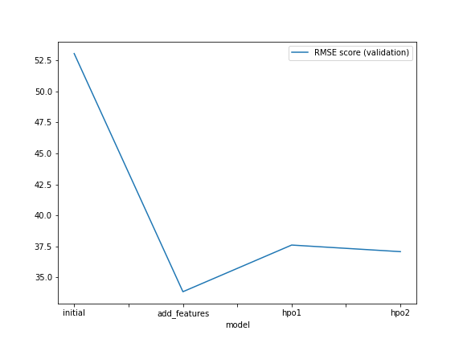
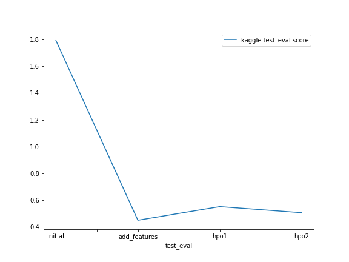

# Report: Predict Bike Sharing Demand with AutoGluon Solution
#### Chaitanya Dinkar Chaudhari

## Initial Training
### What did you realize when you tried to submit your predictions? What changes were needed to the output of the predictor to submit your results?
**Four different experiments were performed as follows:**
1. Initial Raw Submission   **[Model: `initial`]**
2. Added Features Submission *(EDA +  Feature Engineering)* **[Model: `add_features`]**
3. Hyperparameter Optimization (HPO) - optimization 1
4. Hyperparameter Optimization (HPO) - optimization 2 **[Model: `hpo (top-hpo-model: hpo2)`]**

**Observation:** When submitting predictions gathered from each of these four experiments, a few of them yielded negative values in their predictions. 
**Changes incorporated:** Due to Kaggle's policy, submissions that include negative prediction values obtained from the predictor are rejected. As a result, any negative outputs from the respective predictors were substituted with a value of 0. 

### What was the top ranked model that performed?
The `WeightedEnsemble_L3` model, also known as the `(add features) model`, achieved the `highest ranking` among all the models. It achieved a validation **RMSE score of 33.853321** and the best **Kaggle score of 0.45039** `on the test dataset`. This model was developed through exploratory data analysis (EDA) and feature engineering, without the use of hyperparameter optimization. Although some models showed improved RMSE scores on the validation data after hyperparameter optimization, the WeightedEnsemble_L3 model demonstrated the best performance on the unseen test dataset. It's worth noting that several models performed competitively, and the selection process took into account both RMSE (cross-validation) and Kaggle (test data) scores.

## Exploratory data analysis and feature creation
### What did the exploratory analysis find and how did you add additional features?
-The datetime feature was converted into a datetime format to extract the hour information from the timestamp.
-Initially, the independent features season and weather were read as integers. However, since these are categorical variables, they were transformed into the category data type.
-Using feature extraction, the data for year, month, day (day of the week), and hour were extracted as separate independent features from the datetime feature. Subsequently, the datetime feature itself was dropped.
-After careful examination of the features and considering the casual and registered variables, it was observed that the RMSE scores improved significantly during cross-validation. These independent features were found to have a strong correlation with the target variable count. However, since the features casual and registered are only present in the train dataset and not in the test dataset, they were ignored and excluded during the model training process.
-Furthermore, data visualization techniques were employed to gain insights from the features.

### How much better did your model perform after adding additional features and why do you think that is?
-The incorporation of additional features resulted in an approximately 138% improvement in model performance compared to the initial/raw model that did not undergo exploratory data analysis (EDA) or feature engineering.
-The model performance was enhanced by converting certain categorical variables, initially represented as integer data types, into their true categorical data types.
-Apart from excluding the casual and registered features during model training, the atemp feature was also dropped from the datasets due to its high correlation with another independent variable, temp. This step helped reduce multicollinearity.
-Furthermore, splitting the datetime feature into multiple independent features, such as year, month, day, and hour, and introducing the day_type feature contributed to further improving the model performance. These predictor variables facilitated the model in effectively capturing seasonality and historical patterns in the data.

## Hyperparameter tuning
### How much better did your model preform after trying different hyper parameters?
The process of tuning hyperparameters proved advantageous as it improved the model's performance compared to the initial submission. Three distinct configurations were utilized during the hyperparameter optimization experiments. While the hyperparameter-tuned models demonstrated competitive performance compared to the model that underwent exploratory data analysis (EDA) and feature addition, the latter exhibited exceptional performance on the Kaggle (test) dataset.

**Observations:**
- The autogluon package was utilized for training, considering the prescribed settings. However, the performance of hyperparameter optimized models was found to be sub-optimal. This is because the hyperparameters are tuned using a fixed set of values provided by the user, which restricts the exploration options for autogluon.
- Additionally, the 'time_limit' and 'presets' parameters are crucial during hyperparameter optimization with autogluon.
- If the time limit is insufficient for building models, autogluon may fail to generate any models for the given set of hyperparameters.
- Hyperparameter optimization using presets like "high_quality" (with auto_stack enabled) demands high memory usage and is computationally intensive within the specified time limit using available resources. Therefore, lighter and faster preset options such as 'medium_quality' and 'optimized_for_deployment' were experimented with. I opted for the faster and lighter "optimized_for_deployment" preset for the hyperparameter optimization process, as other presets failed to create models using AutoGluon for the experimental configurations.
- One of the significant challenges when using AutoGluon with a prescribed range of hyperparameters is finding the right balance between exploration and exploitation.

### If you were given more time with this dataset, where do you think you would spend more time?
If provided with additional time to work on this dataset, I would be interested in exploring further potential outcomes by running AutoGluon for an extended duration, using a high-quality preset, and conducting enhanced hyperparameter tuning.

### Create a table with the models you ran, the hyperparameters modified, and the kaggle score.
|model|hpo1|hpo2|hpo3|score|
|--|--|--|--|--|
|initial|prescribed_values|prescribed_values|"presets: 'high quality' (auto_stack=True)"|1.79216|
|add_features|prescribed_values|prescribed_values|"presets: 'high quality' (auto_stack=True)"|0.45039|
|hpo (top-hpo-model: hpo2)|Tree-Based Models: (GBM, XT, XGB & RF)|KNN|"presets: 'optimize_for_deployment"|0.50661|

### Create a line plot showing the top model score for the three (or more) training runs during the project.

### Create a line plot showing the top kaggle score for the three (or more) prediction submissions during the project.

## Summary
- The bike sharing demand prediction project extensively utilized the AutoGluon AutoML framework for Tabular Data, which was thoroughly studied and incorporated into the project.
- The capabilities of the AutoGluon framework were fully harnessed to create both automated stack ensembles and individually configured regression models trained on tabular data. This facilitated the rapid prototyping of a baseline model.
- The top-ranked model, based on AutoGluon, demonstrated significant improvements by leveraging data obtained from extensive exploratory data analysis (EDA) and feature engineering, without the need for hyperparameter optimization.
- AutoGluon's automatic hyperparameter tuning, model selection/ensembling, and architecture search enabled it to explore and exploit the best possible options for model performance.
- Although hyperparameter tuning using AutoGluon yielded improved performance compared to the initial raw submission, it did not surpass the model that underwent EDA, feature engineering, and did not undergo hyperparameter tuning.
- It was observed that hyperparameter tuning using AutoGluon, without default hyperparameters or random parameter configurations, can be a cumbersome process. It heavily relies on factors such as the time limit, prescribed presets, possible models to consider, and the range of hyperparameters to be tuned.